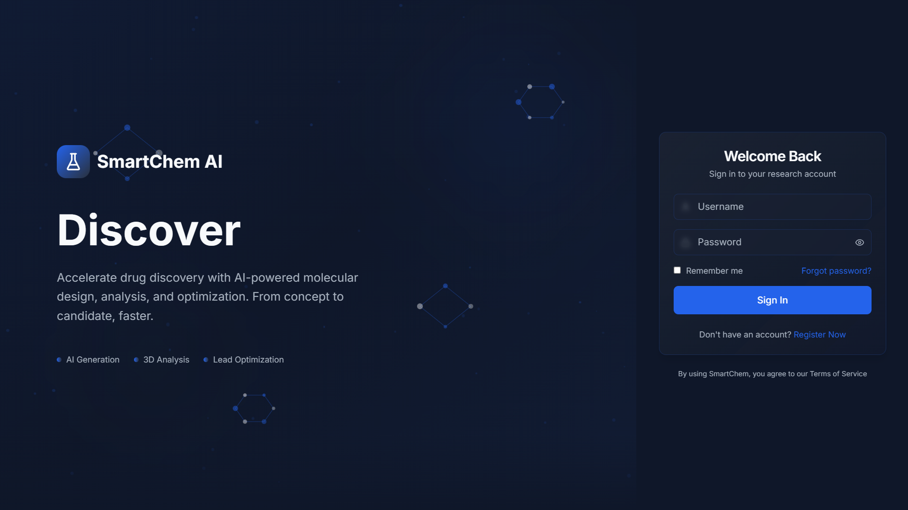

# Smart Chem 🧪

Smart Chem is a cutting-edge **AI-powered Drug Discovery Platform** designed to accelerate the early stages of pharmaceutical research. By leveraging **Variational Autoencoders (VAEs)** and **Deep Learning**, Smart Chem enables researchers to generate novel drug-like molecules, optimize lead compounds, and analyze their physicochemical properties in real-time.



---

## 🚀 Key Features

### 1. **AI Molecule Generation**
   - **Random Generation**: Explore the chemical space by generating novel molecules from the VAE's latent space.
   - **Targeted Generation**: Generate molecules optimized for specific properties like **QED** (Drug-likeness), **LogP** (Lipophilicity), and **SAS** (Synthetic Accessibility).

### 2. **Lead Optimization ("Magic Wand")**
   - Take an existing lead compound (SMILES) and explore its "neighborhood" in the latent space.
   - Find structural variations that improve specific metrics while retaining the core scaffold.

### 3. **Virtual Lab**
   - **ADMET Analysis**: Comprehensive prediction of Absorption, Distribution, Metabolism, Excretion, and Toxicity.
   - **Lipinski's Rule of 5**: Automatic compliance checking for oral bioavailability.
   - **3D Visualization**: Interactive 3D molecular viewer (using `3dmol.js`) to inspect steric structures.

### 4. **Design Studio**
   - A modern, card-based interface to manage generated molecules.
   - Filter, sort, and compare candidates.
   - **Project Management**: Organize your research by saving promising candidates into dedicated project folders.

### 5. **Smart Assistant**
   - An integrated AI assistant to answer queries about chemical properties, synthesis pathways, and general platform usage.

---

## 🛠️ Technology Stack

### **Backend (Python)**
- **FastAPI**: High-performance API framework.
- **PyTorch**: Deep learning framework for the VAE and Property Predictors.
- **RDKit**: Industry-standard cheminformatics library for molecular processing.
- **SELFIES**: Robust molecular string representation (100% valid strings).
- **MongoDB**: NoSQL database for flexible storage of projects and molecules.

### **Frontend (TypeScript)**
- **React (Vite)**: Fast, modern UI library.
- **Tailwind CSS**: Utility-first styling for a sleek, responsive design.
- **Shadcn UI**: Accessible and customizable component library.
- **Framer Motion**: Smooth animations and transitions.
- **Recharts**: Data visualization for property distribution.

---

## 📦 Installation & Setup

### Prerequisites
- **Conda** (Anaconda or Miniconda)
- **Node.js** (v16+) & **npm**
- **MongoDB** (Running locally or cloud URI)

### 1. Backend Setup

Create and activate the Conda environment:

```bash
# Create environment from requirements (if file exists) or manually
conda create -n smartchem python=3.9
conda activate smartchem

# Install Python dependencies
pip install -r requirements.txt
```

Start the Backend Server:

```bash
# From the root directory
uvicorn backend.main:app --reload
```
*Server runs at `http://localhost:8000`*

### 2. Frontend Setup

Navigate to the frontend directory and install dependencies:

```bash
cd frontend
npm install
```

Start the Frontend Development Server:

```bash
npm run dev
```
*App runs at `http://localhost:8080` (or similar)*

---

## 📂 Project Structure

```
Smart Chem/
├── backend/                # FastAPI Application & Logic
│   ├── routers/            # API Endpoints (Auth, Projects, Molecules)
│   ├── models.py           # Pydantic & DB Models
│   ├── chem_utils.py       # RDKit & Calculation Utilities
│   └── main.py             # App Entry Point
├── frontend/               # React Application
│   ├── src/
│   │   ├── components/     # Reusable UI Components
│   │   ├── pages/          # Main Views (DesignStudio, VirtualLab)
│   │   └── lib/            # API Client & Utils
├── data/                   # Dataset Storage
├── checkpoints/            # Trained VAE & Predictor Models
└── train.py                # Model Training Script
```

---

## 📊 Data Pipeline

1.  **Input**: Raw SMILES/SELFIES data.
2.  **Processing**: Tokenization and tensor conversation.
3.  **Training**: VAE learns to map discrete chemical structures to a continuous latent space.
4.  **Inference**: The Decoder generates new molecules from latent vectors, which are then validated and analyzed by RDKit.

---
*Created for Final Year Project - Smart Chem Team*
