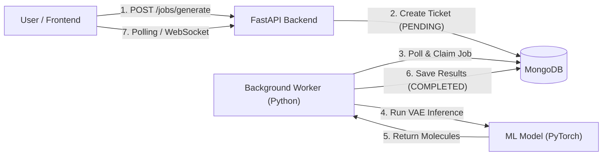

# SmartChem - Generative Drug Discovery Platform

> **A Deep Learning powered platform for generating, optimizing, and evaluating novel drug-like molecules.**

---

## 📖 Introduction
**SmartChem** is a computational drug discovery tool designed to accelerate the "Lead Identification" phase of pharmaceutical research. 

Traditionally, finding new drug candidates is a manual, trial-and-error process. SmartChem automates this by using **Generative AI (Variational Autoencoders)** to explore the chemical space. It allows researchers to:
1.  **Generate** completely new molecular structures.
2.  **Predict** key properties (Solubility, Drug-likeness) instantly.
3.  **Optimize** existing lead compounds to improve their efficacy.

The system is built as a **scalable, asynchronous web application**, ensuring that heavy Machine Learning computations do not block the user experience.

---

## 🏗️ System Architecture

SmartChem follows an **Asynchronous Producer-Consumer** pattern to handle intensive ML workloads.


```mermaid
graph LR
    User["User / Frontend"] -->|"1. POST /jobs/generate"| API["FastAPI Backend"]
    API -->|"2. Create Ticket (PENDING)"| DB[("MongoDB")]
    Worker["Background Worker (Python)"] -->|"3. Poll & Claim Job"| DB
    Worker -->|"4. Run VAE Inference"| Model["ML Model (PyTorch)"]
    Model -->|"5. Return Molecules"| Worker
    Worker -->|"6. Save Results (COMPLETED)"| DB
    User -->|"7. Polling / WebSocket"| API
```

### Key Design Choices:
*   **FastAPI:** Chosen for its high performance and native support for asynchronous programming (`async/await`).
*   **MongoDB:** Used as both the database and the **Job Queue**. Its flexible schema allows storing complex molecular metadata without rigid tables.
*   **Decoupled Worker:** The ML inference runs in a separate process. This ensures the API server remains responsive even if the model is processing a batch of 1,000 molecules.

---

## 🧠 The AI Engine (Machine Learning)

At the core of SmartChem is a **Variational Autoencoder (VAE)** trained on the **Zinc-250k** dataset.

### 1. Representation: SELFIES
Instead of using fragile SMILES strings (which often break), we utilize **SELFIES** (Self-Referencing Embedded Strings).
*   **Advantage:** Every generated SELFIES string corresponds to a valid molecular graph. 100% robustness.

### 2. The Model Architecture
*   **Encoder (1D-CNN):** Convolutional layers scan the chemical string to extract local structural patterns (e.g., benzene rings, functional groups).
*   **Latent Space (128-dim):** The detailed molecule is compressed into a continuous numerical vector ($z$).
*   **Decoder (GRU):** A Recurrent Neural Network reconstructs the molecule character-by-character from the latent vector.

### 3. Optimization (Feedback Loop)
We trained a secondary **Property Predictor (MLP)** that maps the latent vector $z$ directly to properties like **QED** (Drug-likeness) and **LogP** (Solubility).
*   **Gradient Ascent:** We can mathematically "push" a molecule's vector in the direction of higher drug-likeness before decoding it, effectively "optimizing" the drug.

---

## 🛠️ Tech Stack

### Backend & AI
*   **Language:** Python 3.9+
*   **Framework:** FastAPI
*   **ML Libraries:** PyTorch, RDKit (Cheminformatics)
*   **Data Processing:** SELFIES, Pandas, NumPy

### Data & Infrastructure
*   **Database:** MongoDB (NoSQL)
*   **Task Queue:** Custom MongoDB-based Async Worker

### Frontend
*   **Framework:** React / Next.js (if applicable)
*   **Visualization:** 3D Molecule Viewer

---

## 🚀 How to Run Locally

### 1. Install Dependencies
```bash
pip install -r requirements.txt
```

### 2. Start the Database
Ensure MongoDB is running locally on port `27017`.

### 3. Start the API Server
```bash
uvicorn backend.main:app --reload
```
*Server runs at `http://localhost:8000`*

### 4. Start the Async Worker
In a **new terminal**, run the worker to process background jobs:
```bash
python -m backend.worker
```

---

## 🧪 Project Highlights (For Interviewers)
*   **Posterior Collapse Solved:** Implemented **KL-Divergence Annealing** to stabilize VAE training.
*   **Robust Generation:** Transitioned from SMILES to **SELFIES** to guarantee 100% valid chemical outputs.
*   **Scalable Design:** Implemented an **Atomic Job Queue** using MongoDB `find_one_and_update` to handle concurrency.
